## [`hypercube_subspaces`](projects/hypercube_subspaces)

<table>
<tr>
<td>
  <a href="https://commons.wikimedia.org/wiki/File:Cube_subspace_2b5.png">
    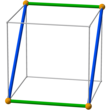
  </a>
<td>
  <a href="https://commons.wikimedia.org/wiki/File:Cube_subspace_1c3.png">
    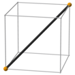
  </a>
<td>
  <a href="https://commons.wikimedia.org/wiki/File:Tesseract_subspace_3b11.png">
    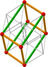
  </a>
<td>
  <a href="https://commons.wikimedia.org/wiki/File:Tesseract_subspace_2b17.png">
    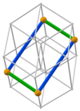
  </a>
<td>
  <a href="https://commons.wikimedia.org/wiki/File:Tesseract_subspace_1b11.png">
    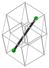
  </a>
<td>
  <a href="https://commons.wikimedia.org/wiki/File:Face_lattice_of_the_tesseract.png">
    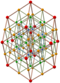
  </a>
<tr>
<td colspan="2">
  <a href="projects/hypercube_subspaces/cube/subspaces.pov">
    <code>cube/subspaces.pov</code>
  </a>
<td colspan="3">
  <a href="projects/hypercube_subspaces/tesseract/povray/subspaces.pov">
    <code>tesseract/povray/subspaces.pov</code>
  </a>
<td>
  <a href="projects/hypercube_subspaces/tesseract/povray/face_lattice.pov">
    <code>face_lattice.pov</code>
  </a>
</table>

Image sets
[Cube subspaces](https://commons.wikimedia.org/wiki/Category:Cube_subspaces_(image_set)),
[Tesseract subspaces](https://commons.wikimedia.org/wiki/Category:Tesseract_subspaces_(image_set)) and
[Face lattice of the tesseract (Bilinski)](https://commons.wikimedia.org/wiki/Category:Face_lattice_of_the_tesseract_(Bilinski))

The [`python`](https://github.com/watchduck/small_povray_projects/tree/master/projects/hypercube_subspaces/tesseract/python) folder 
contains scripts used to create the tesseract files. 
[`e1_store_subspaces.py`](projects/hypercube_subspaces/tesseract/python/e1_store_subspaces.py#L116)
contains the subspaces in the order used to name the files.

## [`permutohedron`](projects/permutohedron)

<table>
<tr>
<td>
  
<td>
  
<td>
  
<tr>
<td>
  <a href="projects/permutohedron/povray/big_tetrahedron.pov">
    <code>big_tetrahedron.pov</code>
  </a>
<td>
  <a href="projects/permutohedron/povray/trunc_octa_perm.pov">
    <code>trunc_octa_perm.pov</code>
  </a>
<td>
  <a href="projects/permutohedron/povray/trunc_octa_cayley.pov">
    <code>trunc_octa_cayley.pov</code>
  </a>
</table>

Image set [Permutohedron of order 4 (raytraced)](https://commons.wikimedia.org/wiki/Category:Permutohedron_of_order_4_(raytraced))

[`a_store_points4.py`](projects/permutohedron/python/a_store_points4.py)
shows the assignment of 4D to 3D points in the simplex.

## [`tesseract_lattice`](projects/tesseract_lattice)

<table>
<tr>
<td>
  
<td>
  
<tr>
<td>
  <a href="projects/tesseract_lattice/plain_tess.pov">
    <code>plain_tess.pov</code>
  </a>
<td>
  <a href="projects/tesseract_lattice/plain_perm.pov">
    <code>plain_perm.pov</code>
  </a>
</table>

Image set [Hexadecachoric group; lattice](https://commons.wikimedia.org/wiki/Category:Hexadecachoric_group;_lattice_(image_set))

## [`four_spheres`](projects/four_spheres)

<table>
<tr>
<td>
  <a href="https://commons.wikimedia.org/wiki/File:4_spheres_as_rings.png">
    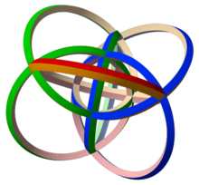
  </a>
<td>
  <a href="https://commons.wikimedia.org/wiki/File:4_spheres,_weight_3,_hollow.png">
    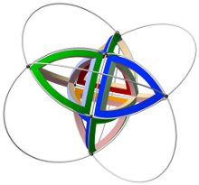
  </a>
<td>
  <a href="https://commons.wikimedia.org/wiki/File:4_spheres,_triangle_01_09.png">
    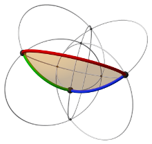
  </a>
<tr>
<td>
  <a href="projects/four_spheres/rings_colored.inc">
    <code>rings_colored.inc</code>
  </a>
<td>
  <a href="projects/four_spheres/cells.inc">
    <code>cells.inc</code>
  </a>
<td>
  <a href="projects/four_spheres/triangles.inc">
    <code>triangles.inc</code>
  </a>
</table>

Image set [Venn spheres rgby](https://commons.wikimedia.org/wiki/Category:Venn_spheres_rgby)

### [`related`](projects/four_spheres/related)

<table>
<tr>
<td>
  <a href="https://commons.wikimedia.org/wiki/File:Tesseract_Schlegel_rgby.png">
    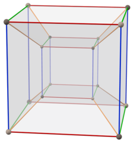
  </a>
<td>
  <a href="https://commons.wikimedia.org/wiki/File:Tesseract_torus.png">
    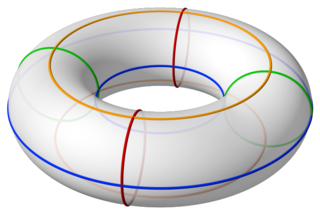
  </a>
<tr>
<td>
  <a href="projects/four_spheres/related/tesseract.inc">
    <code>tesseract.inc</code>
  </a>
<td>
  <a href="projects/four_spheres/related/torus.inc">
    <code>torus.inc</code>
  </a>
</table>

Image set [Tesseract torus rgby](https://commons.wikimedia.org/wiki/Category:Tesseract torus rgby)
